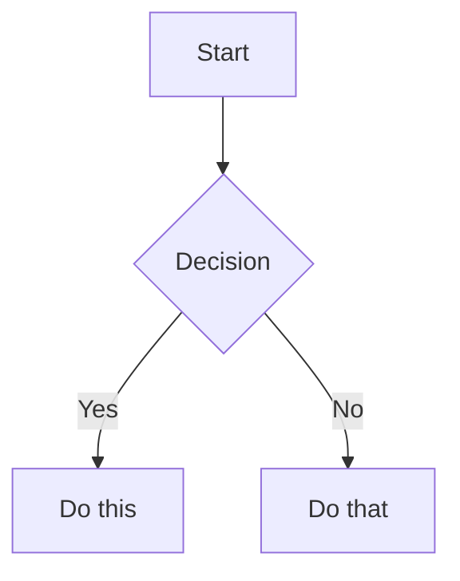

# Obsidian Flavored Markdown

Create and edit valid Obsidian Flavored Markdown, including all Obsidian-specific syntax extensions.

## Markdown Flavors

Obsidian combines CommonMark, GitHub Flavored Markdown, LaTeX for math, and Obsidian-specific extensions (wikilinks, callouts, embeds, etc.).

## Basic Formatting

### Text Formatting

| Style | Syntax |
|-------|--------|
| Bold | `**text**` |
| Italic | `*text*` |
| Bold + Italic | `***text***` |
| Strikethrough | `~~text~~` |
| Highlight | `==text==` |
| Inline code | `` `code` `` |

Escape special characters with backslash: `\*`, `\_`, `\#`, `` \` ``, `\|`, `\~`

## Internal Links (Wikilinks)

```markdown
[[Note Name]]
[[Note Name|Display Text]]
[[Note Name#Heading]]
[[Note Name#^block-id]]
[[#Heading in same note]]
```

Define a block ID by appending `^block-id` at the end of a paragraph:

```markdown
This paragraph can be linked to. ^my-block-id
```

## Embeds

```markdown
![[Note Name]]                  Embed a note
![[Note Name#Heading]]          Embed a heading section
![[Note Name#^block-id]]        Embed a block
![[image.png]]                  Embed an image
![[image.png|300]]              Embed with width
![[image.png|640x480]]          Embed with dimensions
![[audio.mp3]]                  Embed audio
![[document.pdf]]               Embed PDF
![[document.pdf#page=3]]        Embed specific PDF page
```

External images:

```markdown


```

## Callouts

```markdown
> [!note]
> This is a note callout.

> [!info] Custom Title
> Callout with a custom title.

> [!faq]- Collapsed by default
> Foldable content, hidden until expanded.

> [!faq]+ Expanded by default
> Foldable content, visible but collapsible.
```

Callouts can be nested:

```markdown
> [!question] Outer
> > [!note] Inner
> > Nested content
```

### Callout Types

| Type | Aliases |
|------|---------|
| `note` | - |
| `abstract` | `summary`, `tldr` |
| `info` | - |
| `todo` | - |
| `tip` | `hint`, `important` |
| `success` | `check`, `done` |
| `question` | `help`, `faq` |
| `warning` | `caution`, `attention` |
| `failure` | `fail`, `missing` |
| `danger` | `error` |
| `bug` | - |
| `example` | - |
| `quote` | `cite` |

## Task Lists

```markdown
- [ ] Incomplete task
- [x] Completed task
- [ ] Parent task
  - [ ] Subtask
  - [x] Done subtask
```

## Code Blocks

````markdown
```language
code here
```
````

Nest code blocks by using more backticks for the outer block.

## Tables

```markdown
| Left     | Center   | Right    |
|:---------|:--------:|---------:|
| Left     | Center   | Right    |
```

Escape pipes inside tables with `\|`.

## Math (LaTeX)

Inline: `$e^{i\pi} + 1 = 0$`

Block:

```markdown
$$
\frac{a}{b} = c
$$
```

## Diagrams (Mermaid)

````markdown

````

## Footnotes

```markdown
Text with a footnote[^1].

[^1]: Footnote content.

Inline footnote.^[This is inline.]
```

## Comments

```markdown
This is visible %%but this is hidden%% text.

%%
This block is completely hidden in reading view.
%%
```

## Properties (Frontmatter)

YAML frontmatter at the start of a note:

```yaml
---
title: My Note Title
date: 2024-01-15
tags:
  - project
  - important
aliases:
  - My Note
  - Alternative Name
cssclasses:
  - custom-class
status: in-progress
rating: 4.5
completed: false
due: 2024-02-01T14:30:00
---
```

### Property Types

| Type | Example |
|------|---------|
| Text | `title: My Title` |
| Number | `rating: 4.5` |
| Checkbox | `completed: true` |
| Date | `date: 2024-01-15` |
| Date & Time | `due: 2024-01-15T14:30:00` |
| List | `tags: [one, two]` |
| Links | `related: "[[Other Note]]"` |

Default properties: `tags`, `aliases`, `cssclasses`.

## Tags

```markdown
#tag
#nested/tag
#tag-with-dashes
```

Tags can contain letters, numbers (not first), underscores, hyphens, and forward slashes for nesting.

## HTML in Obsidian

```html
<details>
  <summary>Click to expand</summary>
  Hidden content here.
</details>

<kbd>Ctrl</kbd> + <kbd>C</kbd>
```

## Complete Example

````markdown
---
title: Project Alpha
date: 2024-01-15
tags:
  - project
  - active
status: in-progress
---

# Project Alpha

## Overview

This project aims to [[improve workflow]] using modern techniques.

> [!important] Key Deadline
> The first milestone is due on ==January 30th==.

## Tasks

- [x] Initial planning
- [ ] Development phase
  - [ ] Backend implementation
  - [ ] Frontend design
- [ ] Testing

## Technical Notes

The algorithm uses $O(n \log n)$ for sorting.

```python
def process_data(items):
    return sorted(items, key=lambda x: x.priority)
```

## Related

- ![[Meeting Notes 2024-01-10#Decisions]]
- [[Budget Allocation|Budget]]

%%
Internal: Review with team on Friday
%%
````
